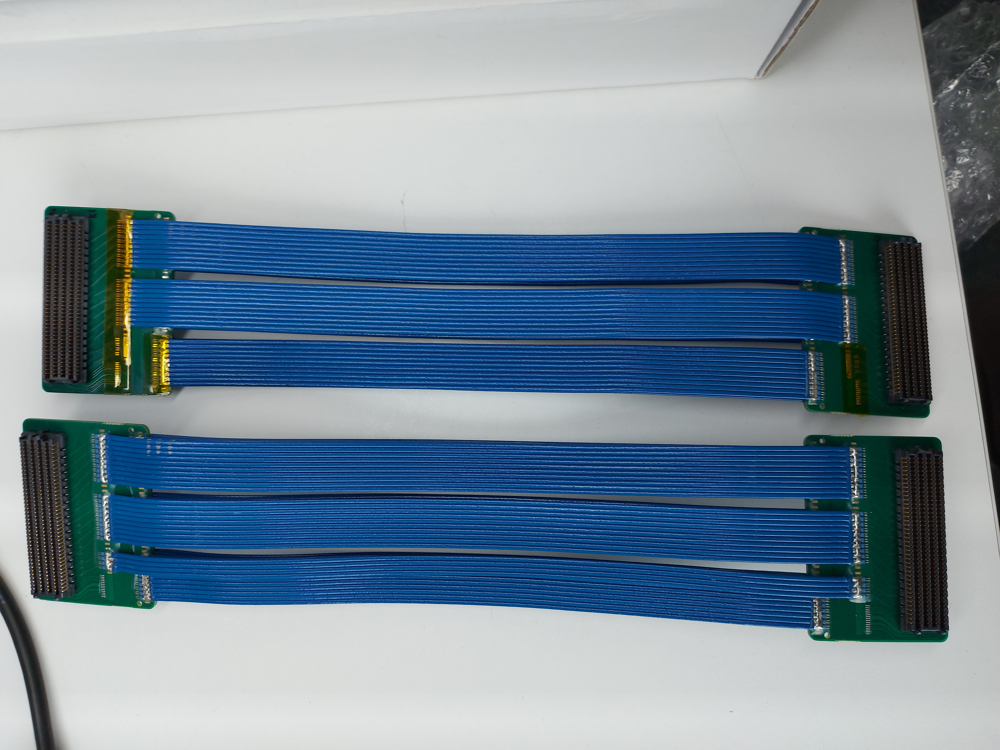
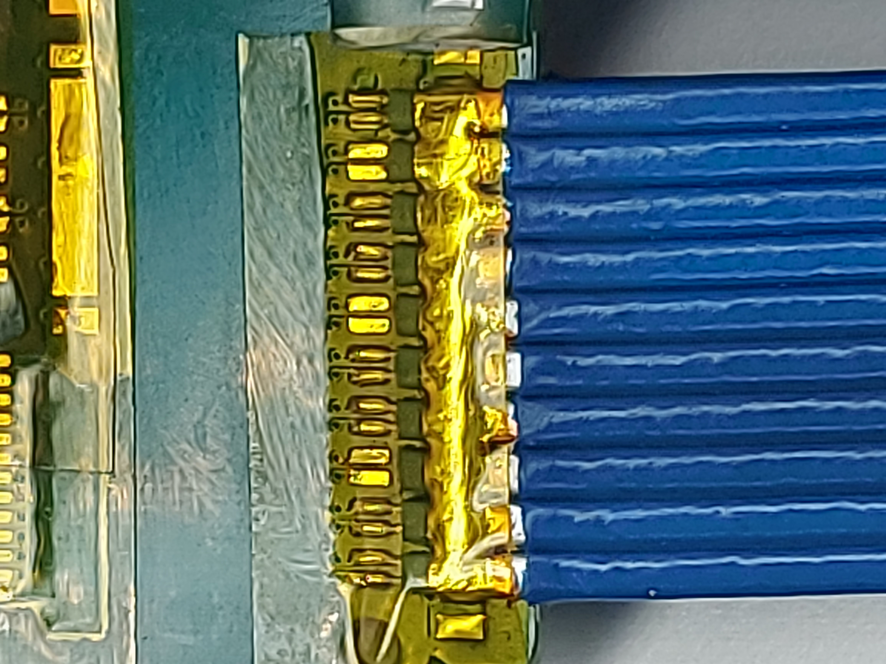

# FMC Connector
[FMC pins](https://fmchub.github.io/appendix/VITA57_FMC_HPC_LPC_SIGNALS_AND_PINOUT.html)

## CAR-RO cable
### Suplier
[Samtec HDR Series Flat Ribbon Cable, 500mm Length](https://ro.rsdelivers.com/product/samtec/hdr-169470-02/samtec-hdr-series-flat-ribbon-cable-500mm-length/2088640)

### Modification
Disconect pins D29-D35. Most probably JTAG(D29 -D31) would have been enough  
  

Before/After  

Zoom in  
  
  
