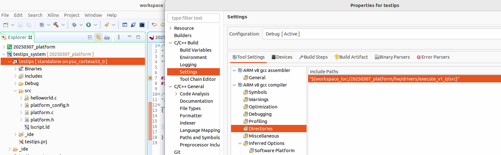

1. From Vivado, File>Export>Export Hardware ...
2. In Vitis, crete platform project based on *.xsa from step 1
3. Create an hello world application
4. Copy testip/helloworld.c over the src/helloworld.c in project from step 3
5. For project from step 4, configure the include path as in picture
